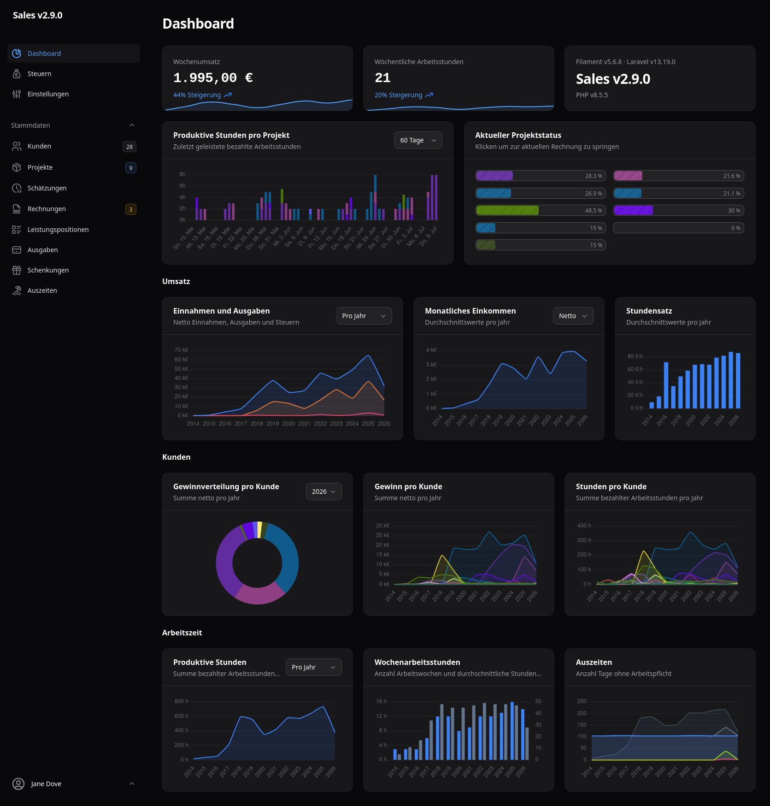

# Sales

A service sales manager especially for freelancers. Built in German, available in English too.

## Features

- A dashboard showing current trends and tax data
- Keep track of clients
- Create projects for clients and provide estimations
- Create invoices and fill them with descriptive positions
- Export quotes or invoices from projects as PDF
- Keep track of expenses and taxes
- Keep track of gifts and donations (e.g. if you're an OS maintainer)
- Anonymize data in staging/dev environments



## Setup

Prerequisites:

- PHP 8.4+
- PHP extensions: mbstring, zip, xml, curl, dom, intl, mysql
- Composer 2.5+

```bash
git clone https://github.com/devmount/sales # get files
cd sales                       # switch to app directory
composer install               # install dependencies
cp .env.example .env           # init environment configuration
touch database/database.sqlite # create database file (or setup your database of choice)
php artisan migrate            # create database structure
php artisan key:generate       # build a secure key for the app
php artisan db:seed            # create initial admin user
npm i
```

## Commands

To anonymize all personal data, run the following command:

```bash
ddev artisan db:anonymize
```

## Development

To start a local development server, make sure to have _Docker_ and _ddev_ installed. Navigate to the project root directory and just run:

```bash
ddev start
```

You can now find the app at <https://sales.ddev.site/> with the initial admin user credentials (email: `admin@example.com`, password: `Joh.3,16`).

If you have issues with missing method or property definitions, the ide-helper definitions might need an upate:

```bash
ddev artisan ide-helper:generate 
```

## Testing

For a simple test suite run, execute:

```bash
ddev artisan test
```

If you want to check coverage, run:

```bash
ddev artisan test --coverage --min=0
```

## Production

To build the application for production, run:

```bash
composer install --optimize-autoloader --no-dev
php artisan config:cache # combine all configuration files into a single, cached file
php artisan route:cache  # reduce all route registrations into a single method call within a cached file
php artisan view:cache   # precompile all blade views
php artisan icons:cache  # precompile all icons
npm run build
```

In `.env` set `APP_DEBUG` to false and `APP_URL` to your production url. Change more values if needed.

The webserver should be configured to serve the `public/` directory as root.

If you don't have composer installed on your webserver (e.g. because you are restricted by your provider), you can download a portable version into the project root:

```bash
wget https://getcomposer.org/download/latest-stable/composer.phar
chmod +x composer.phar
php composer.phar # use composer commands like this
```

## License

This project is a filament / Laravel framework based open-sourced software licensed under the [MIT license](https://opensource.org/licenses/MIT).
